# openshift-docker-lab
## 0. 事前準備
1. IBM Cloudライトアカウント作成
2. GitHubアカウント作成
3. Dockerインストール
4. Docker Hubアカウント作成

### 免責
本ハンズオンワークショップではOpenShiftのクラスタを利用します。
これは、みなさまのIBM Cloudのライトアカウント(クレジットカード不要)に、IBMが準備した作成済みOpenShiftクラスタを持つ**別のアカウントを紐付けた上でOpehShiftを利用します**。
ですので、こちらに記載の手順に従ってお試し頂く中では課金は一切発生いたしません。
ですが、従量課金制のIBM Cloudアカウント(PAYGやサブスクリプション)上にOpenShiftのクラスタを作成したり、有償のサービスを作成したりした場合は課金が発生いたします。
万が一、ご自身のIBM Cloudアカウント(PAYGやサブスクリプション)に対してクラスタを作成するなどして課金が発生した場合、IBM及び本ワークショップの講師は責任を負いかねますので、十分ご注意の上実施下さい。

### OpenShiftへのいろいろな入力パターン
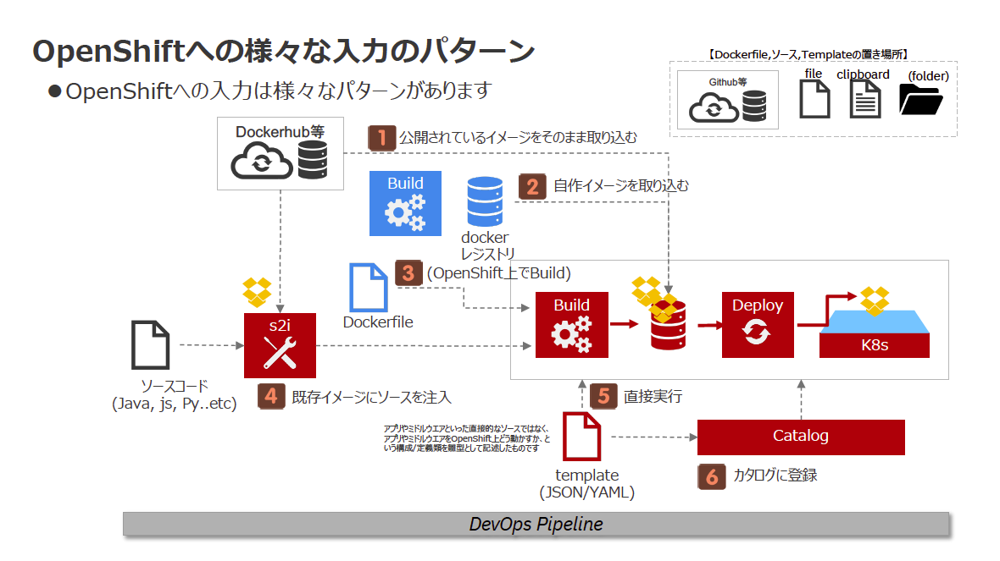

本ハンズオンワークショップではこの中から１または２の「公開されているイメージ/自作イメージを取り込む」を試します。

### ハンズオンワークショップの流れ
1. OpenShift環境の準備
2. Watson Language Translator APIの作成
3. ソースコードのFork
4. Watsonとの接続
5. アプリケーションのBuild
6. Dockerイメージの公開
7. OpenShiftへのデプロイ

## 1. OpenShift環境の準備
ワークショップ⽤のIBM Cloud環境にご⾃⾝のIBM Cloud IDを関連付けます。

注意事項
```
・ブラウザはFirefox, Chromeをご利⽤ください
・本ワークショップ⽤のIBM Cloud環境はセミナー開催時から24時間限定でお使いいただけます
```

### 1.1 下記URLにブラウザでアクセス
ワークショップの場合 **講師よりアクセス先をご案内いたします**。下記はサンプルURLとなります。

https://xxxxxx.mybluemix.net/

### 1.2 ハンズオン環境へSubmit
[Lab Key] 、[Your IBMid]にご⾃⾝のIDを⼊⼒し、チェックボックスにチェックを⼊れて[Submit]をクリックします。
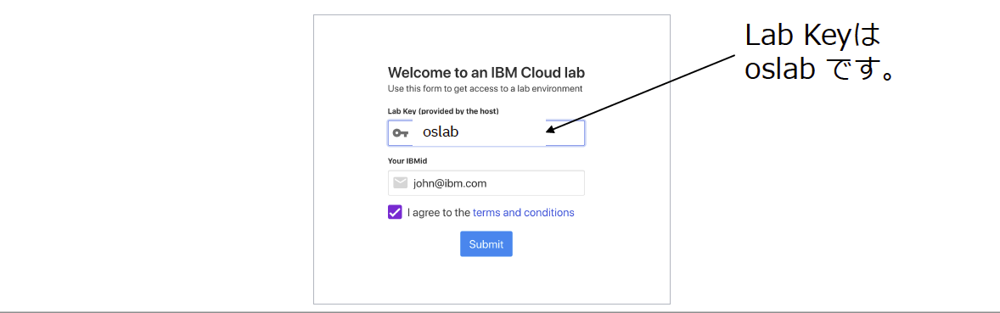

### 1.3 IBM Cloudダッシュボードの起動
Congratulations! が表⽰されたら、指定したIBMid宛に送られるメールを確認します。<br>
メール本文にある[Join now.]のリンクをクリックします。
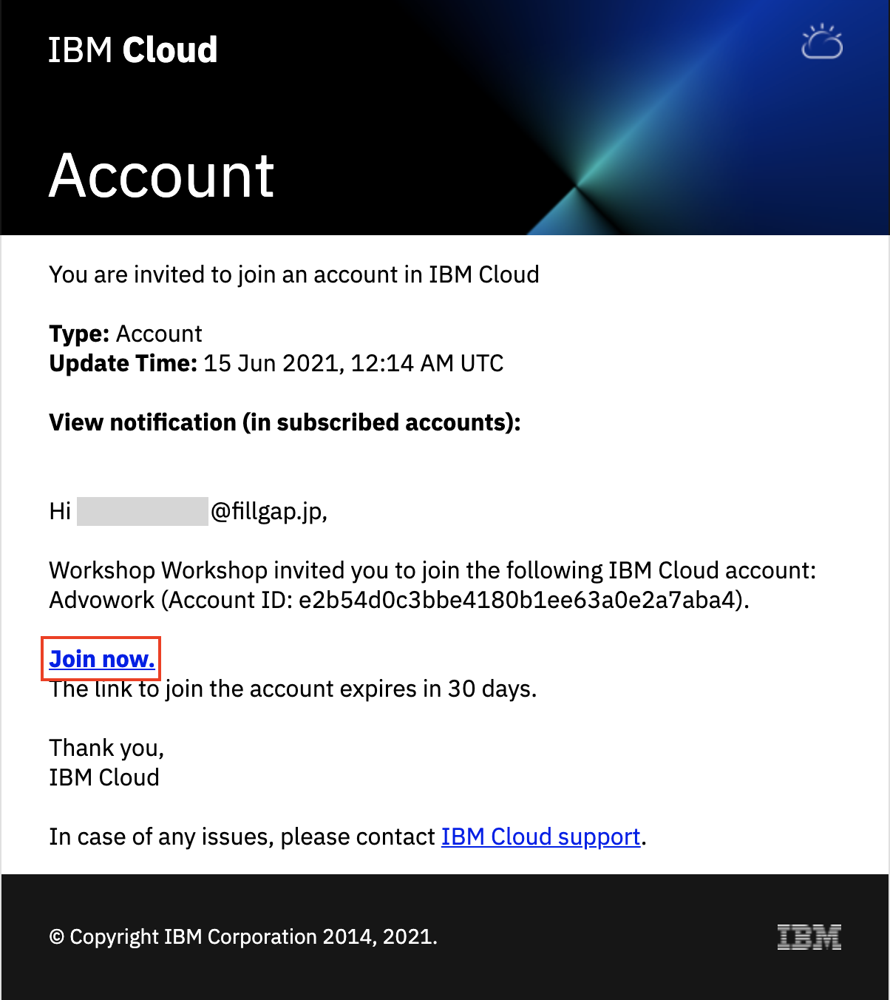

その後IBM Cloudへアカウントを紐付けるための画面が表示されるので、[アカウントに参加]ボタンをクリックします。
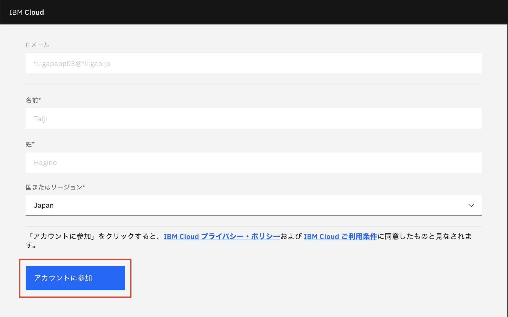

自動でIBM Cloudへログインされます。ログインされない場合は https://cloud.ibm.com へアクセスして手動でログインして下さい。

### 1.4 アカウントの切り替え
IBM Cloudダッシュボードにログインしたら、右上のアカウント情報の右横の「v」をクリックして、ワークショップ用のアカウントへ切り替えます。<br>
[1840867 – Advowork] のような「数字の羅列 - Advowork」がワークショップ用に準備されたアカウントです。 (数字部分は自動的に割り当てられます)<br>
※このアカウントは1日程度で無効になる一時的なアカウントです。
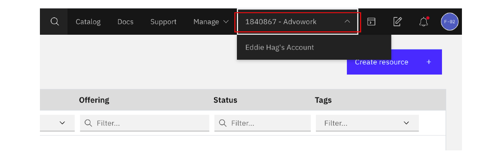

### 1.5 OpenShiftクラスタへのアクセス
IBM Cloudダッシュボードの右上のアカウント情報が変更されたことを確認し、[リソースの要約]の[Clusters]をクリックします。
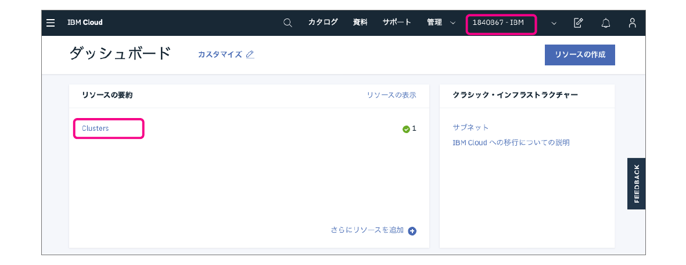

Clustersの下のクラスター名をクリックします。 (クラスター名は⾃動的に割り当てられます)
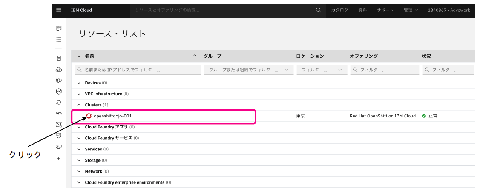

### 1.6 OpenShift Webコンソールの起動
[OpenShift Webコンソール]ボタンをクリックします。<br>
※ポップアップが制御されていると動作しませんので解除してください。
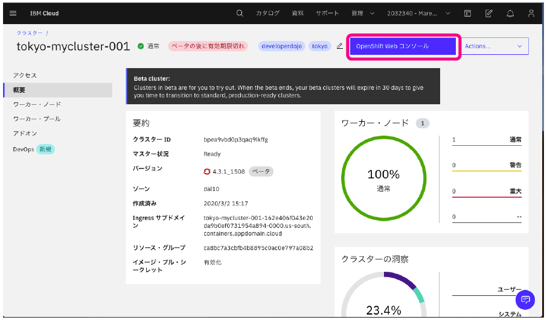

新しいウィンドウ(またはタブ)でOpenShiftのコンソールが開けばOKです。アクセスするURLはポート30000番台(⾃動で割り当てられます)を使っているので、社内プロキシなどで制限している場合はポートを開いておいてください。<br>
Webコンソールは、通常以下のようなURLでリダイレクトされます。
```https://c100-e.jp-tok.containers.cloud.ibm.com:31379/```
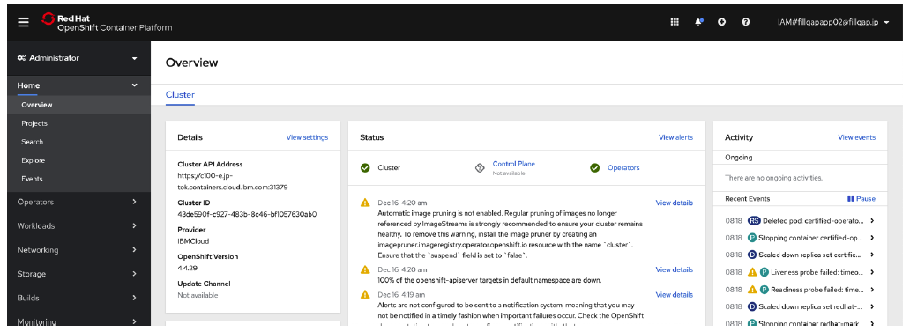

これでOpenShiftの環境準備は完了です。


## 2. Watson Language Translator APIの作成
次に、アプリケーション内で使うWatson Language Translator APIを作成します。

まずは、自分のIBM Cloudアカウント(ライトアカウントをお勧めします)でダッシュボードへログインします。<br>
カタログから検索してWatson Language Translatorのサービスを作成してください。<br>
料金プランはライトを選択してください。ライト以外を選択すると課金されますのでご注意ください。

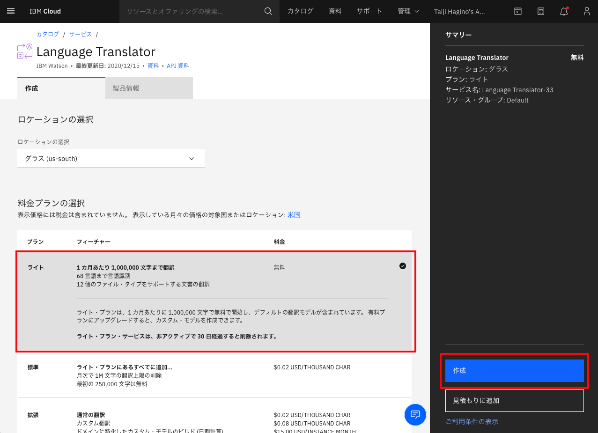

Language Translatorのサービスが作成されたら、資格情報メニューからAPIキーとURLを確認しておいてください。

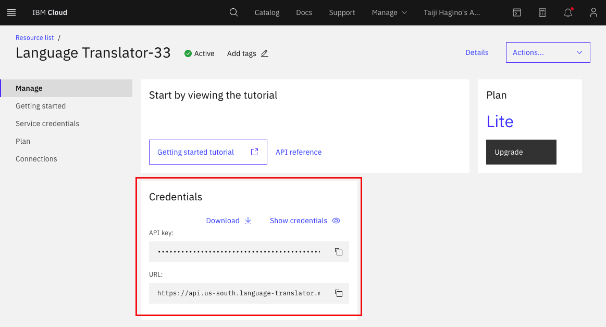

こちらの二つの値は、後ほどNode.jsアプリケーションの中で利用しますので、メモ帳などに控えておいてください。<br>
また、控えた値を消してしまった、控えるのを忘れてしまった、などの場合はIBM Cloudダッシュボードのリソースメニューから、作成したWatson Language Translatorのサービスを選択するとこの画面にアクセスできますのでご安心ください。

これで、Watson Language Translator APIの準備は完了です。


## 3. ソースコードのFork
ここからはGitHubへアクセスして自分のリポジトリへサンプルソースコードをForkしていきます。

### 3.1 GitHubへのサインイン
GitHubにサインイン(Sign in)してください。まだアカウント登録されていない方は[こちら](https://github.com/)からサインアップ(Sign up)してください。<br>
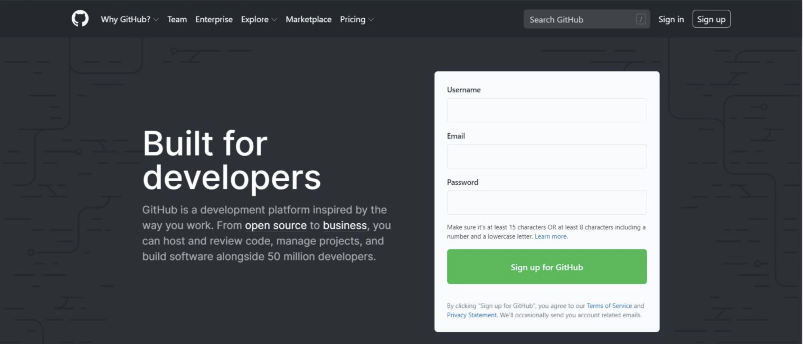

### 3.2 リポジトリーのFork
ブラウザーで[https://github.com/taijihagino/nodejs-watson-translator](https://github.com/taijihagino/nodejs-watson-translator)を開いてください。<br>
[Fork]ボタンをクリックして、自分のアカウントを選択してください。
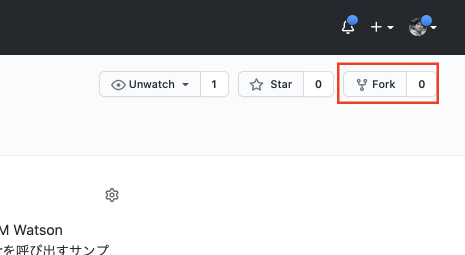

### 3.3 自分のリポジトリーの確認
Forkする際に指定した自分のリポジトリーへ、対象のプロジェクトがForkされたことを確認します。<br>
リポジトリーのパスの最初の部分が自分のGitHubアカウントになっていればOKです。
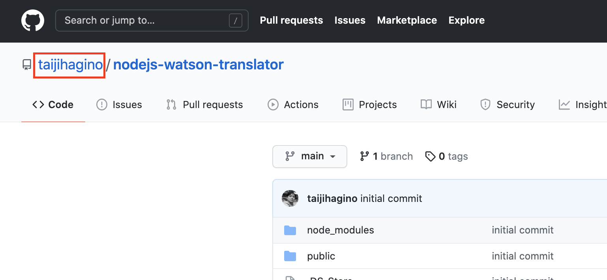


## 4. Watsonとの接続
次に、Cloneしたソースコードを少し編集していきます。<br>
と言っても、Watson Language Translator APIに接続するために必要なAPIキーとURLを記述するだけです。

app.jsをお好みのエディターで開いてください。
32行目にAPIキーを、34行目にAPIのURLを記述してください。シングルコーテーションはそのまま残してください。

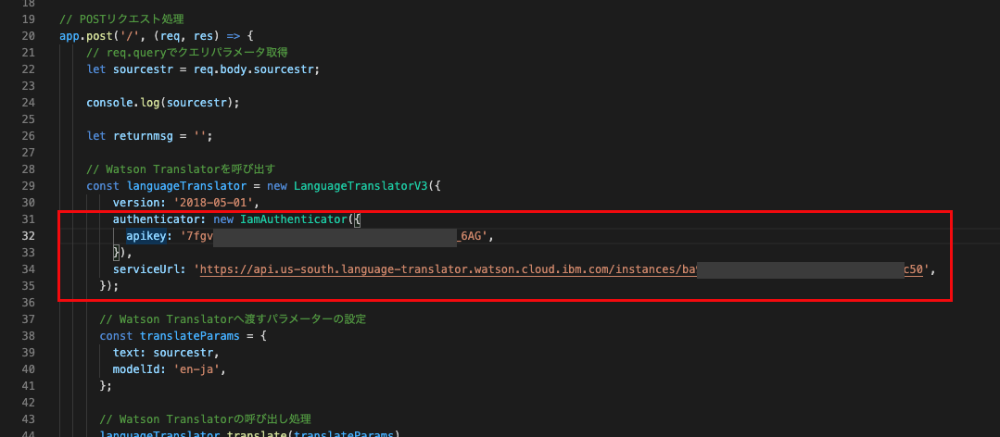

編集が終えたら、保存してapp.jsを閉じます。

これでWatsonとの接続は完了です。


## 5. アプリケーションのBuild
では、実際にこのアプリケーションを動かしていきたいと思います。<br>
ローカルで動かすためにはいくつか方法がありますが、まずはnpmで起動してみたいと思います。以下のコマンドを実行してください。

```
$ npm run start
<中略>
Example app listening on port 3000!
```

ポート3000番でListenが開始したらWebアプリへアクセスできるはずです。

基本的に、npmで引っ張ってくる依存ファイルはすべてGitHubへ一緒に置いてますのでそのまま実行できると思います。もし、モジュールが見つからないなどありましたら ```npm install``` を実行してください。

localhost:3000へアクセスして、以下のような画面が表示されればOKです。試しに英文を適当に入力して[送信する]ボタンをクリックしてください。

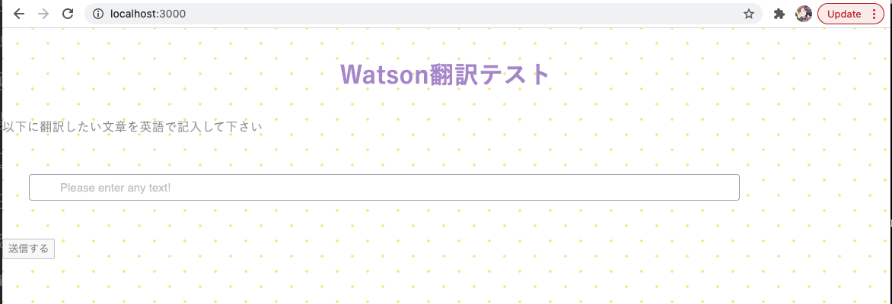

翻訳結果が表示されれば、無事Watsonと通信できたということです。


## 6. Dockerイメージの公開
さて、今回はOpenShift上へこのアプリケーションをデプロイしたいのですが、npmでそのまま実行するわけにいかないので、コンテナイメージを作成してそのイメージファイルをOpenShiftで読み込むようにします。

### 6.1 ローカルでの動作確認
まずは、ローカル環境のDockerでコンテナアプリとして動くかを確認します。

Dockerコマンドを使ってビルドします。以下のコマンドを実行してください。
```
$ docker build -t <ご自身のDocker Hubのアカウント名>/nodejs-watson-translator .
```

ビルドが成功したら、次のコマンドでコンテナを実行します。
```
$ docker run -d -p 3000:3000 <ご自身のDocker Hubのアカウント名>/nodejs-watson-translator
```

私の環境でしたら次のような感じになります。
```
$ docker run -d -p 3000:3000 taiponrock/nodejs-watson-translator
a6aaa34b0f1f0a83d57df3f7764e5c9e50be4ce1df9601599dc8286538394f3a
```

実行後に表示されているのはコンテナのIDです。<br>
再びlocalhost:3000にアクセスすると、先ほど同様アプリの画面が表示されるはずです。


これで、Dockerとしてアプリケーションが動くことが確認できました。

### 6.2 コンテナイメージの公開
そうしましたら、このコンテナイメージファイル(Docker Image)をDocker Hubへ公開します。<br>
以下の通り、コマンドを実行してください。

Dockerへログインします。
```
$ docker login
```

Docker Hubへイメージファイルをpushします。
```
$ docker push <ご自身のDocker Hubのアカウント名>/nodejs-watson-translator:latest
```

私の環境でしたら次のような感じになります。
```
$ docker push taiponrock/nodejs-watson-translator:latest
The push refers to repository [docker.io/taiponrock/nodejs-watson-translator]
6dadc0517cfe: Pushed 
47d727401e8c: Pushed 
fa0c4106b05b: Pushed 
b390bbd1c681: Pushed 
80d970d3a8e3: Mounted from library/node 
c785d091c329: Mounted from library/node 
80b812438a89: Mounted from library/node 
33dd93485756: Mounted from library/node 
607d71c12b77: Mounted from library/node 
052174538f53: Mounted from library/node 
8abfe7e7c816: Mounted from library/node 
c8b886062a47: Mounted from library/node 
16fc2e3ca032: Mounted from library/node 
latest: digest: sha256:e0999c27660b41c88775d67fe9443ec50b9bd9858b27c4beed82a7aedfb5774f size: 3053
$
```

もしpushの途中でうまくいかず、「denied: requested access to the resource is denied」と表示された場合は、Dockerアカウントのログインに失敗しているか、コンテナイメージ名につけたユーザー名がDockerアカウントと異なっている可能性があります。

正常に完了すると、DockerHubの自分のリポジトリにpushしたコンテナイメージが表示されます。
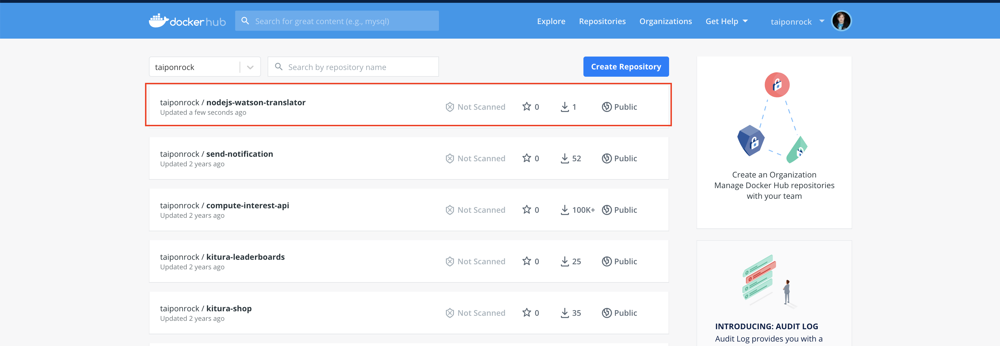

これで、Docker Image(コンテナイメージファイル)の公開が完了しました。

### 6.3 ローカル環境のDockerコンテナの削除
先ほど動作確認を行ったので、ローカル端末上でDockerコンテナが稼働しています。不要であれば次のように削除してください。

まずは対象となるコンテナIDを確認します。
```
$ docker ps -a
CONTAINER ID        IMAGE                                 COMMAND                  CREATED             STATUS                      PORTS                    NAMES
a6aaa34b0f1f        taiponrock/nodejs-watson-translator   "docker-entrypoint.s…"   15 minutes ago      Up 15 minutes               0.0.0.0:3000->3000/tcp   admiring_liskov
0539b6929d74        taiponrock/nodejs-watson-translator   "docker-entrypoint.s…"   3 hours ago         Exited (0) 29 minutes ago                            adoring_carson
```

対象のコンテナIDを指定して```docker stop``` コマンドを実施します。
```
$ docker stop a6aaa34b0f1f
a6aaa34b0f1f
```

Dockerに関しての手順は以上になります。


## 7. OpenShiftへのデプロイ
ここからは、先程用意したOpenShiftの環境へ、自分のDocker Hubに公開しているアプリケーション(コンテナイメージ)をデプロイします。

### 7.1 OpenShift Projectの作成
OpenShiftのWebコンソールへ戻り、[Project]ボタンをクリックします。
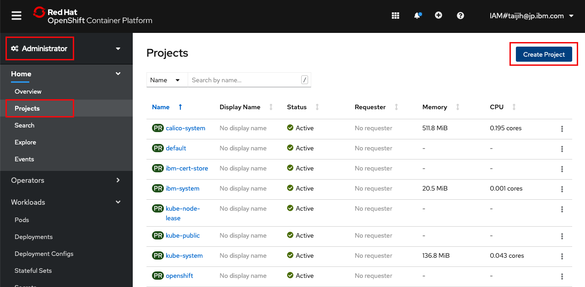

その後[Create Project]ボタンをクリックするとCreate Project画面が開きますので、任意のプロジェクト名を入力してください。例では「tech-dojo-prj」としています。
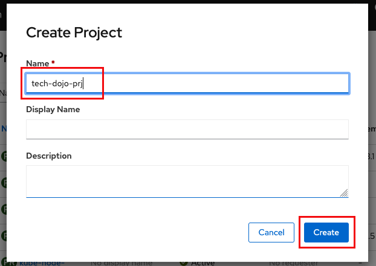


### 7.2 OpenShiftユーザータイプの切り替え
左上のメニューにて、[Administrator]から[Developer]に切り替えます。<br>
切り替えたら[Container Image]をクリックしてください。
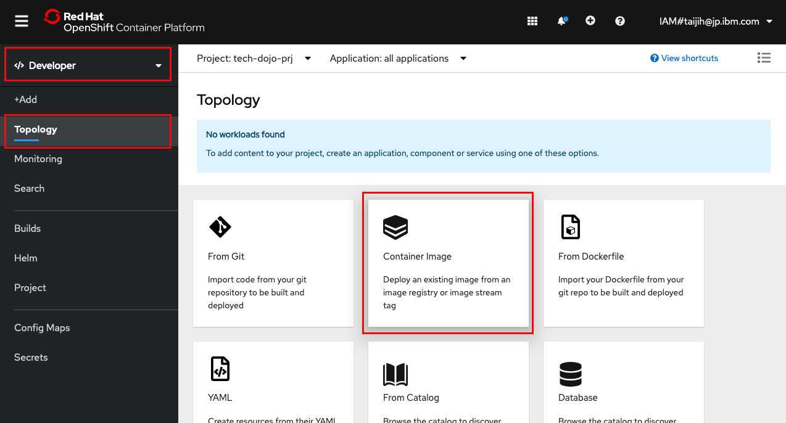

### 7.3 デプロイするアプリケーションのイメージファイルを指定
OpenShift上へデプロイするアプリケーションのコンテナイメージを指定します。OpenShiftでは、デフォルトでDocker Hubを参照するようになっていますので、```<ご自身のDocker Hubのアカウント名>/nodejs-watson-translator``` を指定してください。

私の環境でしたら次のような感じになります。
```taiponrock/nodejs-watson-translator```

これを[Image name from external registry
]に指定します。Doker Hubのイメージを指定すると自動でチェックが行われ、問題なければテキストボックスの右側に緑色のチェックマークが付き、[Validated]の文字が表示されます。<br>
その他の項目はデフォルトのままで[Create]ボタンをクリックしてください。
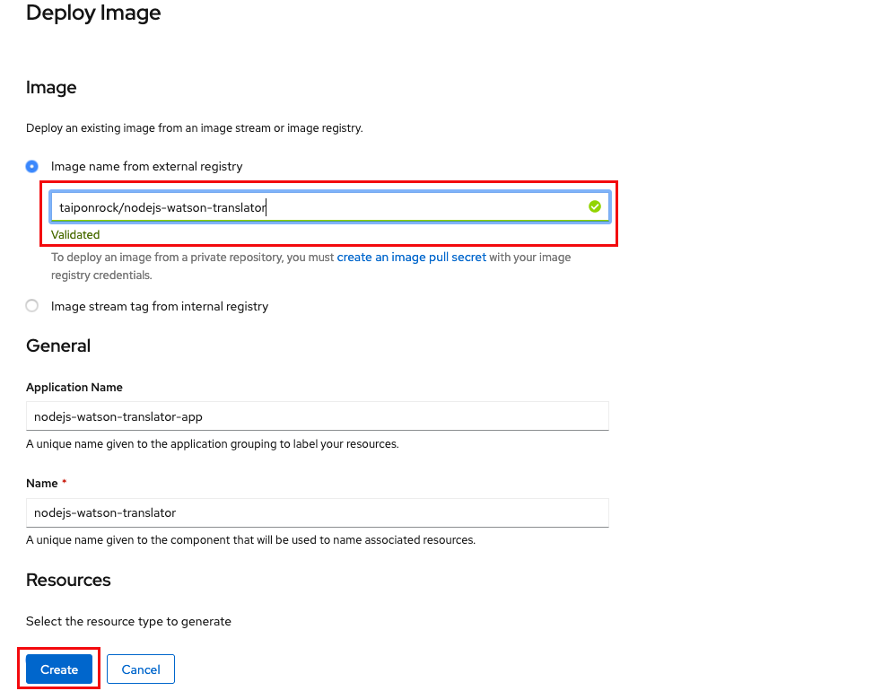

### 7.4 アプリケーションのデプロイ
アプリケーションのデプロイが始まります。1分弱お待ちください。中の丸が青くなったら完成です。丸の中をクリックすると右側にメニューが出てくるので[Routes]の下のURLをクリックするとWebへ公開されたアプリケーションへアクセスできます。
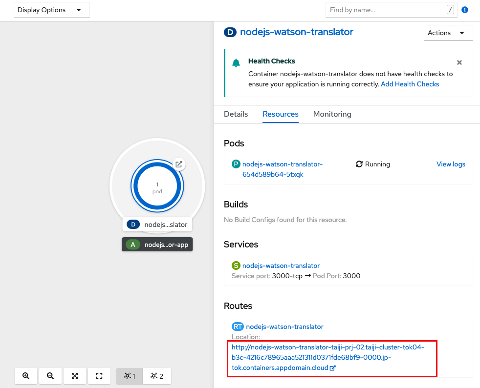

### 7.5 アプリケーションへのアクセス
デプロイされ、Webへ公開されたアプリケーションへアクセスできました。<br>
実際に翻訳を試してみましょう。<br>
英文を入力して[送信する]ボタンをクリックすると、翻訳結果が表示されます。
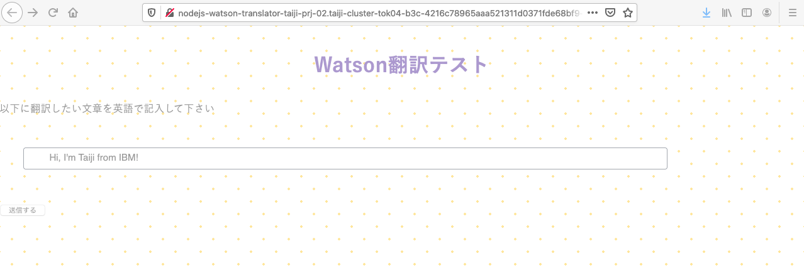


お疲れさまでした！これで、Watsonと連携したNode.jsアプリケーションをDockerイメージを使ってOpenShiftへデプロイするハンズオンワークショップは完了です。


## さいごに
今回はわかりやすいように非常にシンプルなNode.jsアプリケーションでハンズオンを行いました。基本的にDockerで動くアプリケーションでしたら今回の手順でOpenShift上へデプロイすることが可能ですので、いろいろなアプリケーションで試してみてください。
